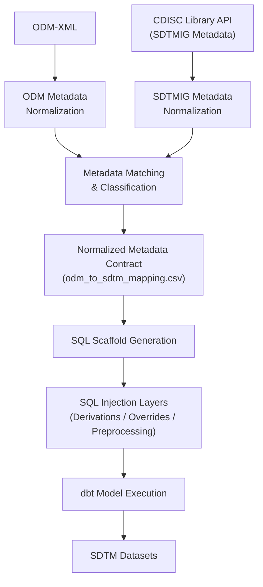

# SDTM Blueprint‑as‑a‑Service (BaaS)

> ⚠️ **Project Status:** This repository is under active development. Expect ongoing refactoring, feature additions, and changes until the first stable release.

Metadata‑driven scaffolding and reproducible pipelines for SDTM domain production, powered by ODM‑XML to standard JSON, dbt, and injection overrides.

## Tools & Technologies Used:
<div align="center">
  
  
  
  
  
  
  
  
</div>

## Table of Contents
- [Concept](#concept)
- [High-Level Architecture](#high-level-architecture)
- [Repository Structure](#-repository-structure)
- [Quick Start](#quick-start)
- [High-level Workflow](#high-level-workflow)
- [Roadmap](#roadmap)
- [FAQ](#faq)

<!-- - [Commands & scripts](#commands--scripts)
- [Configuration](#configuration)
- [Conventions](#conventions)
- [Roadmap](#roadmap) -->
---

## Concept
**Blueprint-as-a-Service (BaaS)** is an experimental, metadata-driven framework for generating SDTM-compliant transformation logic from CDISC ODM 2.0–aligned study metadata.

Instead of hand-coding SDTM domains or relying on enterprise transformation tools, BaaS treats SDTM generation as a repeatable, inspectable, and extensible blueprint, driven by metadata, configuration, and controlled overrides.

- **Metadata first**: ODM is treated as a primary source of truth — not just a transport format.

- **Scaffold, then override**: Generate a complete SDTM SQL template, then inject study-specific logic where needed.

- **Separation of concerns**:
  - Parsing & normalization
  - Matching & mapping
  - SQL scaffolding
- Execution (dbt)

- **Study-isolated execution**: Each study is self-contained but powered by shared platform logic.

## High-Level Architecture
### High-Level End-to-End Workflow


---

## 📁 Repository Structure

<details>
<summary><strong>Platform Layer (`odm-2-0/`)</strong></summary>

```text
odm-2-0/
├── adapters/
│   └── odm_json/
│       ├── extractors/
│       ├── matchers/
│       ├── scaffolds/
│       ├── schemas/
│       └── utils/
├── bin/
├── logs/
├── requirements.txt
└── studies/
```
</details> 

<details> 
<summary><strong>Study Layer (`studies/VEXIN-03/`)</strong></summary>

```text
studies/VEXIN-03/
├── config/
├── inputs/
├── overrides/
├── runs/
└── dbt/
```
</details>

> **Note:** The scaffolder reads per‑study config and writes dbt SQL into the study’s `dbt/models/sdtm/`.

---

## Quick start
### Prerequisites
- **Python 3.11+**
- **dbt-core** (DuckDB profile for local test runs) and **DuckDB**
- **poetry** or **pip + venv**

### Sample setup
#### Clone the repo and install dependencies:
```bash
# initialize
git init

# clone the repo
git clone https://github.com/mlogan914/sdtm-blueprint-as-a-service.git
cd sdtm-blueprint-as-a-service

# set up virtual environment
python3 -m venv .venv && source .venv/bin/activate
echo ".venv/" >> .gitignore

# install dependencies
cd odm-2-0
pip install -r requirements.txt
```

#### Set up duckdb and dbt:
```bash
cd studies/VEXIN-03/dbt

# confirm duckdb was intalled (in requirements.txt)
duckdb --version

# create a persistent database
duckdb dev.duckdb

# Exit duckdb
.exit

# confirm dbt was intalled (in requirements.txt)
dbt --version

# initialize dbt (if no existing profiles)
dbt init

# Update profiles.yml
vim ~/.dbt/profiles.yml
```

#### dbt profiles.yml example:
```yml
VEXIN_03:
  outputs:
    dev:
      type: duckdb
      path: dev.duckdb
      threads: 1

    prod:
      type: duckdb
      path: prod.duckdb
      threads: 4
```
#### Load the sample data into the database:

```bash
# from dbt directory
dbt seed
```

> **NOTE**: Sample raw data (**raw_dm.csv**) is located in the **odm-2-0/studies/VEXIN-03/dbt/seeds** folder.

### Demo (VEXIN‑03)
```bash
# from repo root
cd ~/sdtm-blueprint-as-a-service/odm-2-0
./run_baas.sh VEXIN-03 # study paramter required (e.g., VEXIN‑03)

# scaffolding output confirmation:
INFO: ✅ Generated SQL scaffold → /home/user/sdtm-blueprint-as-a-service/odm-2-0/studies/VEXIN-03/dbt/models/sdtm/dm.sql
```

#### Generate the table:
```
# create DM (demographics) domain
# from dbt models directory
dbt run --select dm --vars '{domain: "DM"}'
```

#### Sample output:
```bash
(.venv) user@user-VirtualMachine:~/sdtm-blueprint-as-a-service/odm-2-0/studies/VEXIN-03/dbt$ dbt run --select dm --vars '{domain: "DM"}'
17:58:13  Running with dbt=1.10.4
17:58:14  Registered adapter: duckdb=1.9.4
17:58:15  Found 2 models, 1 seed, 430 macros
17:58:15  
17:58:15  Concurrency: 1 threads (target='dev')
17:58:15  
17:58:15  1 of 1 START sql view model main.scaffold_dm ................................... [RUN]
17:58:15  1 of 1 OK created sql view model main.scaffold_dm .............................. [OK in 0.15s]
17:58:15  
17:58:15  Finished running 1 view model in 0 hours 0 minutes and 0.68 seconds (0.68s).
17:58:15  
17:58:15  Completed successfully
17:58:15  
17:58:15  Done. PASS=1 WARN=0 ERROR=0 SKIP=0 NO-OP=0 TOTAL=1
```

#### View domain records:
```bash
(.venv) user@user-VirtualMachine:~/sdtm-blueprint-as-a-service/odm-2-0/studies/VEXIN-03/dbt$ duckdb dev.duckdb
<jemalloc>: Out-of-range conf value: narenas:0
v1.1.3 19864453f7
Enter ".help" for usage hints.
D show tables;
┌─────────────────────┐
│        name         │
│       varchar       │
├─────────────────────┤
│ dm                  │
│ my_first_dbt_model  │       │
└─────────────────────┘
D select * from dm limit 5
  ;
┌──────────┬─────────┬───────────────┬─────────┬─────────┬─────────┬──────────┬───┬─────────┬────────────┬───────┬───────┬───────┬───────┬────────────────────┐
│ STUDYID  │ DOMAIN  │    USUBJID    │ SUBJID  │ RFSTDTC │ RFENDTC │ RFXSTDTC │ … │ COUNTRY │   DMDTC    │ DMDY  │ QVAL  │  DY   │ EPOCH │ ISSUE_FLAG_USUBJID │
│ varchar  │ varchar │    varchar    │ varchar │  int32  │  int32  │  int32   │   │ varchar │  varchar   │ int32 │ int32 │ int32 │ int32 │       int32        │
├──────────┼─────────┼───────────────┼─────────┼─────────┼─────────┼──────────┼───┼─────────┼────────────┼───────┼───────┼───────┼───────┼────────────────────┤
│ VEXIN-03 │ DM      │ VEXIN03-99163 │ 1001    │         │         │          │ … │ USA     │ 2021-09-07 │       │       │       │       │                    │
│ VEXIN-03 │ DM      │ VEXIN03-1002  │ 1002    │         │         │          │ … │ USA     │ 2022-06-04 │       │       │       │       │                    │
│ VEXIN-03 │ DM      │ VEXIN03-1003  │ 1003    │         │         │          │ … │ USA     │ 2020-01-15 │       │       │       │       │                    │
│ VEXIN-03 │ DM      │ VEXIN03-99680 │ 1004    │         │         │          │ … │ USA     │ 2024-09-25 │       │       │       │       │                    │
│ VEXIN-03 │ DM      │ VEXIN03-1005  │ 1005    │         │         │          │ … │ USA     │ 2024-07-12 │       │       │       │       │                    │
├──────────┴─────────┴───────────────┴─────────┴─────────┴─────────┴──────────┴───┴─────────┴────────────┴───────┴───────┴───────┴───────┴────────────────────┤
│ 5 rows                                                                                                                                36 columns (14 shown) │
└─────────────────────────────────────────────────────────────────────────────────────────────────────────────────────────────────────────────────────────────┘
D 
```
---

## High-level workflow
1. **Extract & normalize ODM**
   - Convert ODM‑XML → normalized JSON (adapter under `odm-2-0/adapters/odm_json/`).
2. **Match to SDTM reference**
   - Compare normalized ItemOIDs/Names to SDTMIG variable catalog; mark mapping type:
     - *direct* (1:1)
     - *standard‑derived* (macro/known calc)
     - *custom* (needs override)
     - *suppqual* (SUPPxx).
3. **Scaffold dbt SQL**
   - Generate `studies/<study>/dbt/models/sdtm/<domain>.sql` with jinja slots for derivations.
4. **Inject derivations**
   - Insert snippets from standatd or custom derivations into the scaffold.
     - **Custom:** `studies/<study>/overrides/custom/<domain>/derive_<var>.sql`
     - **Standard:** `studies/<study>/overrides/standard/derive_<var>.sql`
5. **Run dbt**
   - Target DuckDB for local dev; same SQL can target Snowflake/Redshift/etc.
6. **Validate**
   - (Planned) automated checks & tests under `dbt/tests/` and custom validators.

---

## Roadmap
- [x] ODM-JSON adapter workflow
- [x] ODM-JSON adapter conversion
- [x] Define Pre-Processing Data Injection Logic
- [x] DuckDB local profile and first end‑to‑end dbt run
- [x] Injection of standard/custom derivations via jinja templates
- [x] Injection of standard/custom derivations via jinja macros
- [🔄 In progress]: Use CTEs as a “prepend/append rows” layer at the very start of the domain build
- [x] Start documentation (Normalization and scaffolding logic)
- [ ] Multi‑domain runs
- [ ] SUPPQUAL generation
- [ ] Automated tests/validators (schema + content checks)
- [ ] Warehouse targets (Snowflake/Redshift/BigQuery) via dbt profiles
- [ ] CLI packaging (pipx/poetry) + `baas` command
- [ ] GitHub Actions CI for lint + tests + sample run artifacts

---

## FAQ
**Is this production‑ready?**  
Not yet. It’s a working blueprint under active development; expect refactors and changes.

**Can I run all domains at once?**  
Yes in principle, extend `run_baas.sh` to iterate over a domain list:
```python
...
DOMAIN_LIST=("DM")  # Add more like "AE" "VS" etc.
...
```

**Where would conversions live?**  
Use dbt macros in the study project (e.g., `convert_us_to_iso8601.sql`), referenced by generated SQL or overrides.

**What if ItemDef `Name` ≠ the OID suffix?**  
The matcher handles the `Name` vs `OID` discrepancy and records the resolved target variable; check the mapping CSV before scaffolding.

<!-- ---
## License
MIT (or chosen permissive license). Add a LICENSE file at repo root. --> 
