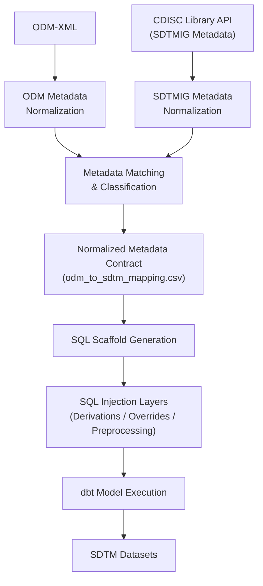

# Blueprint-as-a-Service Architecture Overview

## Purpose

Blueprint-as-a-Service is a metadata-driven SDTM transformation architecture project that explores how existing clinical metadata standards can be operationalized into reusable transformation, scaffolding, and orchestration workflows.

The project currently focuses on:

- ODM metadata normalization
- SDTM metadata normalization
- Metadata-driven matching and classification
- Modular SQL scaffold generation
- Injection-based transformation behavior
- dbt-based SDTM model execution

The broader architectural direction explores what becomes possible when clinical metadata standards are treated as executable transformation architecture rather than passive documentation artifacts.

---

# Core Architectural Concept

The architecture intentionally separates:

- Metadata normalization
- Metadata matching and classification
- Scaffold generation
- SQL transformation injection
- Future orchestration behavior

to allow each layer to evolve somewhat independently.

The current direction increasingly resembles a metadata-driven transformation and orchestration framework rather than a traditional hardcoded SDTM transformation pipeline.

A core architectural principle is:

```text
Generate stable transformation scaffolds from metadata,
while allowing configurable injection of sponsor-specific
or domain-specific transformation behavior.
```

---

# High-Level End-to-End Workflow



---

# Current Architecture Layers

## 1. Metadata Normalization Layer

Purpose:

- Convert ODM and SDTM reference metadata into predictable internal structures for downstream processing.

Current components include:

```text
convert_odm_xml_to_json.py
normalize_sdtmig_json.py
```

Outputs include:

```text
odm_crf_metadata.json
sdtmig_v3_4_normalized.json
```

---

## 2. Metadata Matching and Classification Layer

Purpose:

- Match ODM-derived metadata to SDTM reference metadata
- Produce normalized metadata contracts
- Classify transformation behavior

Current primary implementation:

```text
match_odm_to_sdtm.py
```

Primary output:

```text
odm_to_sdtm_mapping.csv
```

This layer currently supports:

- OID-based matching
- Alias-driven classification
- Derivation classification
- SUPPQUAL routing
- Future Nonstandard Variable routing
- Metadata contract generation

Detailed documentation:

```text
docs/matching_logic.md
```

---

## 3. Metadata Contract Layer

The mapping CSV acts as a normalized metadata contract between:

- Matching logic
- Scaffold generation
- Validation workflows
- Future lineage workflows
- Future orchestration behavior

The CSV is intentionally treated as:

- A metadata contract
- A debugging surface
- A transformation classification layer
- A future extensibility layer

rather than a temporary export artifact.

---

## 4. SQL Scaffold Generation Layer

Purpose:

- Generate scaffolded dbt SQL models from metadata contracts.

Current primary implementation:

```text
scaffold_sql.py
```

Current scaffold behavior includes:

- Direct mapping generation
- Placeholder generation
- Derivation injection support
- Domain scaffold generation
- Experimental preprocessing injection

Detailed documentation:

```text
docs/scaffold_generation_logic.md
```

---

## 5. SQL Injection Layer

A major architectural concept of the project is injection-based transformation behavior.

The scaffold framework intentionally separates:

- Stable scaffold generation
from:
- Configurable transformation logic

Current injection architecture includes:

```text
overrides/standard/
overrides/custom/<domain>/
```

Current injection behavior includes:

- Standard derivation injection
- Custom derivation injection
- Experimental preprocessing CTE injection

This architecture allows sponsor-specific transformation logic to evolve independently from the scaffold engine itself.

---

## 6. dbt Execution Layer

Generated scaffold SQL is intended to execute as dbt models.

Current architecture direction includes:

- Modular dbt model generation
- Ordered SDTM variable output
- Reusable transformation logic
- Future lineage-aware execution behavior
- Future validation-aware workflows

Current outputs include scaffolded domain models such as:

```text
scaffold_dm.sql
scaffold_suppdm.sql
```

which ultimately execute into SDTM datasets.

---

# Current Experimental Areas

Several architectural areas remain intentionally experimental or partially implemented.

Current experimental areas include:

- SUPPQUAL scaffold generation
- Nonstandard Variable support
- Reusable derivation framework behavior
- Metadata-driven preprocessing orchestration
- CTE injection architecture
- Validation-aware scaffolding
- Lineage-aware transformation workflows
- Confidence scoring behavior

These areas should currently be treated as evolving architecture direction rather than finalized implementation behavior.

---

# Architectural Philosophy

The broader architectural hypothesis behind the project is:

```text
Existing clinical metadata standards already contain
significantly more transformation, lineage, and orchestration
potential than most current implementations operationalize.
```

The project therefore explores what becomes possible when:

- Metadata is treated as executable architecture
- Semantic identifiers are operationalized intentionally
- Transformation behavior becomes metadata-driven
- SQL logic becomes injectable and modular
- Orchestration behavior is separated from transformation behavior

rather than tightly coupling all SDTM transformation logic into monolithic pipelines.

---

# Recommended Reading Order

Recommended detailed architecture reading order:

1. `docs/matching_logic.md`
2. `docs/scaffold_generation_logic.md`

Potential future documents:

- `dbt_project_architecture.md`
- `validation_architecture.md`
- `lineage_architecture.md`
- `orchestration_architecture.md`

---

# Current Architectural State

The project is currently transitioning from exploratory prototype architecture toward a more formalized metadata-driven transformation framework.

Some behaviors remain intentionally fluid as the architecture continues evolving.

This document should therefore be treated as a high-level architectural overview rather than finalized platform specification documentation.

---

--- End of Architecture Overview ---
