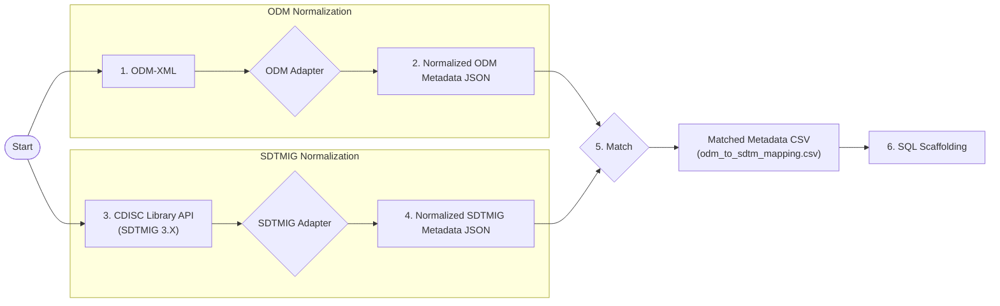
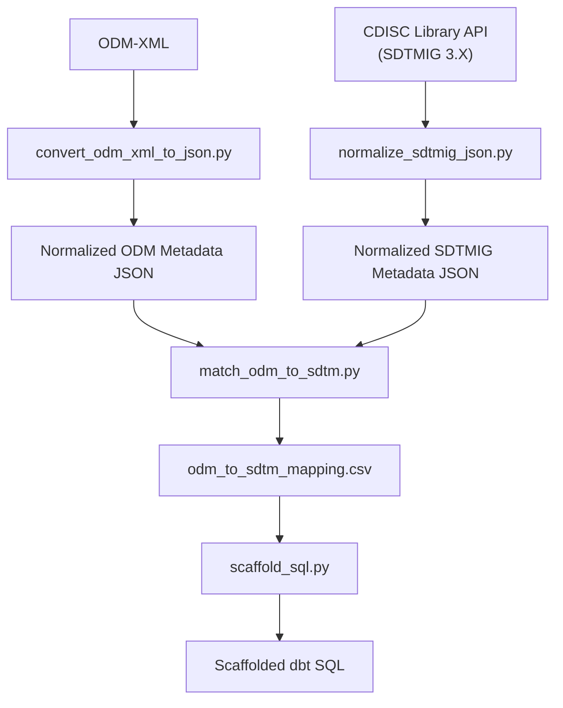

# ODM to SDTM Matching Logic

## Purpose

Describe how ODM-derived metadata structures are matched to SDTMIG reference metadata in order to generate candidate SDTM mappings and scaffold downstream dbt SQL models.

This document reflects the current implementation state and architectural assumptions of the project. Some behaviors are intentionally fluid and may evolve as the architecture matures.

---

## Workflow Reference

### Related Design and Architecture References
The adapter workflow and design evolution were originally documented in:

- [Issue #11 - Original Draft: High-Level Data Processing Workflow](https://github.com/mlogan914/sdtm-blueprint-as-a-service/issues/11)
- [Issue #40 - Brainstorm: ODM-JSON Adapter Workflow](https://github.com/mlogan914/sdtm-blueprint-as-a-service/issues/40)
- [Issue #42 - Brainstorm: SQL Scaffolding Mapping Logic](https://github.com/mlogan914/sdtm-blueprint-as-a-service/issues/42)
- [Issue #54 - Updates: Directory Structure and Naming Conventions](https://github.com/mlogan914/sdtm-blueprint-as-a-service/issues/54)


The diagrams below reflect the current implemented architecture and execution flow.

## Current Pipeline

### High-Level Matching Architecture


### High-Level Matching Execution Flow


Core matching logic currently exists in:

```text
adapters/odm_json/matchers/match_odm_to_sdtm.py
```

Core SQL scaffolding logic currently exists in:

```text
adapters/odm_json/scaffolds/scaffold_sql.py
```
---

## Workflow Steps

### 1. Convert ODM XML to Normalized ODM Metadata JSON

Script:

```text
adapters/odm_json/extractors/convert_odm_xml_to_json.py
```

Purpose:

- Validate or process ODM-XML input
- Convert ODM-XML into a usable ODM-derived JSON metadata structure

Primary output:

```text
odm_crf_metadata.json
```

### 2. Convert CDISC Library SDTMIG Metadata to Normalized SDTMIG JSON

Script:

```text
adapters/odm_json/extractors/normalize_sdtmig_json.py
```

Purpose:

- Take SDTMIG metadata from the CDISC Library
- Normalize it into a consistent JSON reference structure for lookup and matching

Primary output:

```text
sdtmig_v3_4_normalized.json
```

### 3. Match ODM Metadata to SDTMIG Metadata

Script:

```text
adapters/odm_json/matchers/match_odm_to_sdtm.py
```

Purpose:

- Match collected ODM field metadata to associated SDTMIG variables
- Classify mapping behavior
- Generate the intermediate mapping CSV

Primary output:

```text
odm_to_sdtm_mapping.csv
```

### 4. Generate SQL Scaffolds

Script:

```text
adapters/odm_json/scaffolds/scaffold_sql.py
```

Purpose:

- Consume the mapping CSV
- Generate scaffolded dbt SQL models by domain
- Identify direct mappings, derivations, SUPPQUAL mappings, and manual intervention points

Example output:

```text
scaffold_dm.sql
scaffold_suppdm.sql
```

---

# Design History and Brainstorming References

GitHub Issue #42 contains brainstorming around SQL scaffolding rules using matched CSV results.

The issue is useful design context, but should not be treated as fully implemented behavior unless confirmed in code.

The design intent described there includes:

- Use `ItemOID` for variable matching where OID conventions are sponsor-controlled
- Use aliases to define scaffolding logic or derivation intent
- Infer mapping types such as `Direct`, `Derived`, `SUPPQUAL`, and `Unmatched`
- Scaffold 1:1 mappings directly when no alias is present
- Use `DERIVATION_TARGET` to identify the SDTM variable being produced
- Use `DERIVATION_RULE` to identify the derivation logic or rule name
- Use `SUPPQUAL` aliases to scaffold supplemental qualifier structures
- Route unmatched mappings to manual intervention

This aligns with the current architecture direction: OID-based matching provides the stable primary mapping layer, while aliases provide transformation/scaffolding context.

However, several ideas in Issue #42 may remain conceptual or partially implemented, especially around reusable derivation macros, scaffold consumption of `Derivation_Rule`, and extended SUPPQUAL derivation behavior.

---

# Key Assumption: Sponsor-Controlled OIDs

The current matcher assumes ODM ItemDef OIDs follow a sponsor-controlled naming convention.

Example:

```text
IT.DM.SUBJID
```

This structure allows the matcher to infer:

- ODM object type: `IT`
- SDTM domain: `DM`
- Candidate SDTM variable: `SUBJID`

The matcher currently uses the parsed `(domain, variable)` pair as the primary matching key against normalized SDTMIG metadata.

Example:

```text
(DM, SUBJID)
```

We will define a naming convention that includes:
- Prefix/Qualifier (e.g. ITEM, FORM etc.)
- Domain (e.g. DM, AE, etc.,)
- Variable name (e.g. RACE, AETERM, etc.,)

Examples:
- `<prefix>.<name>`
- `<prefix>.<domain>.<CDASH-compliant-name>`

### OID Prefixes or Qualifiers:

Prefix | Meaning | ODM Element | Example
-- | -- | -- | --
FILE | File Identifier | ODM FileOID | `FileOID="FILE.VEXIN03-001-EDCEXP-20250620`
FORM | Form | ItemGroupOID | `<ItemGroupRef ItemGroupOID="FORM.DM"/>`
IT | Item (e.g., ItemDef) | `<ItemDef>` | `<ItemRef ItemOID="IT.DM.RACE">`
MDV | MetaData Version | `<MetaDataVersion>` | `<MetaDataVersion OID="MDV.2">`
SE | Study Event | `<StudyEventDef>` | `<StudyEventDef OID="SE.DEMOGRAPHICS">`
ST | Study | `<Study>` | `<ClinicalData StudyOID="ST.VEXIN-03">`

## Important Limitation

This strategy is only appropriate when OIDs are intentionally governed and semantically meaningful.

If OIDs are automatically generated by an EDC or metadata platform without sponsor control over naming conventions, this approach should not be treated as a reliable primary matching mechanism.

> The rationale for this assumption is documented in GitHub Issue #29.

---

# Current Matching Strategy

## 1. Primary Matching Key

Current implementation behavior:

- Parse ODM ItemOID
- Extract domain + variable
- Match against normalized SDTMIG reference metadata

Example:

```text
IT.AE.AETERM
→ Domain: AE
→ Variable: AETERM
```

This becomes:

```text
(AE, AETERM)
```

which is matched against the SDTMIG lookup.

---

## 2. Current Mapping Types

The current mapping CSV classifies mappings into several categories:

### Direct

The ODM item maps directly to a standard SDTM variable using the OID-derived key.

### Derived

The ODM item contributes to a derived SDTM variable.

### SUPPQUAL

The ODM item is routed to supplemental qualifiers.

### Not_Standard (**Future)

The ODM item is routed to Nonstandard Variables.

### Unmatched

The SDTMIG variable exists for the domain but no ODM item matched it.

### Not_Submitted

The ODM item exists in metadata but is intentionally excluded from submission output.

---

# Current Alias Behavior

Aliases are currently used to extend or override relationships that cannot be represented cleanly by the OID alone.

## Current Supported Alias Contexts

### DERIVATION_TARGET

Represents the SDTM variable being produced by a derivation.

Example:

```text
DERIVATION_TARGET = AGE
```

### DERIVATION_RULE

Represents the named derivation logic or rule used to produce the target variable.

Example:

```text
DERIVATION_RULE = age_from_brthdtc_rfstdtc
```

### SUPPQUAL.*

Used to route metadata into SUPPQUAL handling.

Examples include:

- QNAM
- QLABEL
- IDVAR
- IDVARVAL

### NOT_STANDARD (**Future)
Used to route metadata into Nonstandard Variables handling.


### NOT_SUBMITTED

Marks a field as intentionally excluded from SDTM submission output.

---

# Derivation Alias Semantics

The implementation in:

```text
adapters/odm_json/matchers/match_odm_to_sdtm.py
```

now preserves the semantic distinction between:

- `DERIVATION_TARGET`
- `DERIVATION_RULE`

The intended distinction is:

| Alias Context | Output Field | Intended Meaning |
|---|---|---|
| DERIVATION_TARGET | Derived_Target | The SDTM variable being produced |
| DERIVATION_RULE | Derivation_Rule | The derivation logic or rule name |

This correction prevents two separate metadata concepts from being collapsed into one field.

Example:

```text
DERIVATION_TARGET = AGE
DERIVATION_RULE   = age_from_brthdtc_rfstdtc
```

Expected mapping output:

| Derived_Target | Derivation_Rule |
|---|---|
| AGE | age_from_brthdtc_rfstdtc |

---

# Current Scaffold Behavior

Current scaffold generation consumes the mapping CSV as its primary metadata contract layer.

Current scaffold behavior relies primarily on:

- `SDTM_Variable`
- `Raw_Input_Name`
- `Mapping_Type`

However, scaffold generation does not currently operationalize the `Derived_Target` and `Derivation_Rule` fields independently.

This means the matcher semantics have been corrected independently of scaffold integration.

Future scaffold enhancements may leverage:

- `Derived_Target`
- `Derivation_Rule`

for reusable derivation injection, lineage-aware scaffolding, and macro/template selection.

---

# OID vs Alias Responsibilities

## OID Responsibilities

OID is currently used for:

- Stable metadata identity
- Primary SDTM candidate matching
- Cross-study consistency
- Deterministic lookup behavior

## Alias Responsibilities

Aliases are currently used when the relationship cannot be expressed cleanly through OID structure alone.

Examples:

- Derived variables
- Multiple collected fields contributing to one SDTM variable
- SUPPQUAL routing
- Alternate semantic mapping targets
---

# CSV Output Contract

The matcher produces a normalized metadata mapping file:

```text
odm_to_sdtm_mapping.csv
```

This CSV acts as an intermediate metadata contract between:

- ODM-derived metadata
- SDTM reference metadata
- Scaffold generation logic
- Future validation and lineage workflows

The CSV is generated by:

```text
adapters/odm_json/matchers/match_odm_to_sdtm.py
```

and is later consumed by downstream scaffold generation processes such as:

```text
adapters/odm_json/scaffolds/scaffold_sql.py
```

---

## Core Output Fields

### ItemOID

The original ODM ItemDef OID.

Example:

```text
IT.DM.SUBJID
```

Used for:

- Metadata traceability
- Stable identity
- Sponsor-controlled matching behavior

### ODM_Variable

The ODM variable name derived from the metadata extraction layer.

Example:

```text
SUBJID
```

### ODM_Domain

The inferred ODM/SDTM domain derived from OID parsing.

Example:

```text
DM
```

### Raw_Input_Name

The original collected/raw source field name.

This may differ from the OID suffix depending on ODM implementation details.

Example:

```text
subject_identifier
```

This distinction is important because:

- OID is treated as the semantic metadata identifier
- `Raw_Input_Name` reflects actual collected/source data structure

### SDTM_Variable

The matched candidate SDTM variable.

Example:

```text
SUBJID
```

This field reflects the current SDTM mapping target associated with the row.

### Mapping_Type

High-level mapping classification.

Current supported values include:

| Mapping_Type | Meaning |
|---|---|
| Direct | Direct ODM to SDTM mapping |
| Derived | Variable participates in derivation logic |
| SUPPQUAL | Routed to supplemental qualifiers |
| Not_Standard (**Future) | Routed to Nonstandard Variables |
| Unmatched | No matching ODM metadata found |
| Not_Submitted | Intentionally excluded from submission |

### Match_Type

Describes how the mapping relationship was identified.

Examples:

| Match_Type | Meaning |
|---|---|
| OID.Exact | Exact OID-derived match |
| Alias.Derivation | Derived relationship identified via aliases |
| Alias.SUPP | SUPPQUAL mapping identified via aliases |
| Alias.NS (**Future)| Nonstandard Variable mapping identified via aliases |

This field is intended to support:

- Debugging
- Lineage tracing
- Future confidence scoring
- Validation workflows

### Derived_Target

Represents the SDTM variable being produced by a derivation.

Example:

```text
AGE
```

This field originates from:

```text
DERIVATION_TARGET
```

metadata aliases.

### Derivation_Rule

Represents the derivation logic or derivation implementation name.

Example:

```text
age_from_brthdtc_rfstdtc
```

This field originates from:

```text
DERIVATION_RULE
```

metadata aliases.

This distinction allows the architecture to preserve both:

- What variable is being derived
- How it is derived

independently.

### Alias_Context

The alias classification context associated with the metadata row.

Examples:

```text
DERIVATION_TARGET
SUPPQUAL
NOT_SUBMITTED
```

### Alias_Name

The alias value associated with the alias context.

Example:

```text
AGE
```

or:

```text
QNAM
```

depending on alias usage.

---

## Architectural Purpose of the CSV

The CSV intentionally acts as a decoupled metadata contract layer.

This separation allows:

- Matching logic
- Scaffold generation
- Validation
- Lineage tracking 
- Future orchestration workflows

to evolve somewhat independently.

The CSV is therefore treated as:

- An implementation artifact
- A debugging surface
- A future extensibility layer

rather than simply a temporary export.

---

# Current Architectural State

The project is currently transitioning from prototype architecture toward a more formalized metadata platform structure.

Some areas remain intentionally fluid, including:

- Adapter abstractions
- Derivation handling strategy
- Alias standardization
- Confidence scoring
- Validation framework behavior
- Scaffold generation extensibility

This document should therefore be treated as a living architecture reference rather than finalized specification documentation.

---

# Future Sections

- High-Level Scaffold Generation Architecture
- High-Level dbt Project Architecture
- High-Level Derivation Injection Flow
- Validation and Traceability Architecture

---

--- End of Current Matching Documentation ---