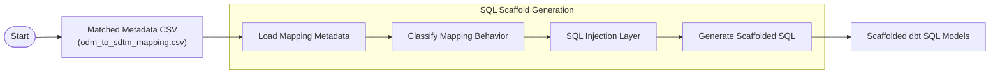
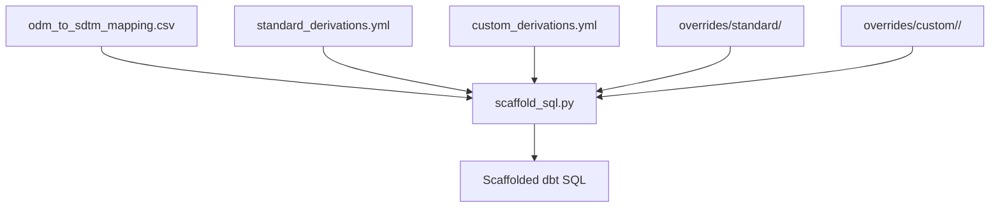

# SQL Scaffold Generation Logic

## Purpose

Describe how matched ODM-to-SDTM metadata is converted into scaffolded dbt SQL models.

This document reflects the current scaffold generation architecture, implementation behavior, and evolving design direction for the Blueprint-as-a-Service project.

Some areas remain intentionally fluid as the architecture continues evolving toward a more generalized metadata-driven transformation framework.

---

## Workflow Reference

### Related Design and Architecture References
The scaffold generation architecture and design evolution were originally discussed in:

- [Issue #20 - Brainstorm: Injection-Based Override Model](https://github.com/mlogan914/sdtm-blueprint-as-a-service/issues/20)
- [Issue #42 - Brainstorm: SQL Scaffolding Mapping Logic](https://github.com/mlogan914/sdtm-blueprint-as-a-service/issues/42)
- [Issue #62 - Brainstorm: Pre-Processing Data Injection Logic](https://github.com/mlogan914/sdtm-blueprint-as-a-service/issues/62)


This document reflects current implemented behavior, along with architecture direction where implementation is still evolving.

---

## Current Scaffold Pipeline

### High-Level Scaffold Architecture



## High-Level Scaffold Execution Flow



Primary scaffold generation implementation:

```text
adapters/odm_json/scaffolds/scaffold_sql.py
```

---

# Scaffold Workflow Steps

## 1. Load Mapping Metadata

The scaffold generation process consumes the normalized metadata contract:

```text
odm_to_sdtm_mapping.csv
```

This CSV is produced by:

```text
match_odm_to_sdtm.py
```

The scaffold layer uses the CSV as the primary metadata contract between:

- Metadata matching
- SQL generation
- Derivation injection
- Future validation workflows
- Future lineage workflows

---

## 2. Load Scaffold Configuration

Scaffold generation also consumes derivation configuration files.

Observed examples include:

```text
standard_derivations.yml
custom_derivations.yml
```

These configurations define:

- Standard derivation behavior
- Custom derivation behavior
- Override behavior
- SQL injection behavior

---

## 3. Load SQL Injection Fragments

The current architecture supports reusable SQL fragment injection.

Observed override structure includes:

```text
overrides/standard/
overrides/custom/<domain>/
```

The SQL injection layer is a core architectural feature of the scaffold framework.

This allows:

- Reusable derivation logic
- Sponsor-specific transformation logic
- Domain-specific override behavior
- Incremental scaffold enhancement
- Configurable transformation behavior

without tightly coupling all derivations into scaffold generation code.

---

## 4. Generate Scaffolded SQL Models

The scaffold engine generates dbt-compatible SQL models.

Observed scaffold characteristics include:

- dbt config blocks
- SELECT-based scaffold generation
- Ordered SDTM variable output
- Optional CTE generation
- Derivation injection support
- Placeholder generation for incomplete logic

Observed examples include:

```text
scaffold_dm.sql
scaffold_suppdm.sql
```

---

# Current Scaffold Generation Behavior

## Direct Mapping Behavior

Direct mappings scaffold as source column projections.

Observed behavior resembles:

```sql
raw_dm.subject_identifier AS USUBJID
```

This behavior is primarily driven by:

- Mapping_Type = Direct
- Raw_Input_Name
- SDTM_Variable

---

## Derived Variable Behavior

Derived variables currently scaffold using one of several approaches.

### Standard Derivation Injection

If a reusable standard derivation exists:

```text
overrides/standard/derive_<var>.sql
```

the SQL fragment is injected into scaffold generation output.

---

### Custom Derivation Injection

If a sponsor-specific or domain-specific derivation exists:

```text
overrides/custom/<domain>/derive_<var>.sql
```

the SQL fragment is injected into scaffold generation output.

This allows custom logic to remain modular and independently maintainable.

---

### Placeholder Scaffold Logic

If derivation logic is not yet implemented, placeholder logic is scaffolded.

Observed behavior resembles:

```sql
NULL AS AGE -- TODO
```

This intentionally surfaces incomplete implementation areas while preserving overall scaffold structure.

---

## Unmatched Variable Behavior

Unmatched variables currently scaffold as NULL placeholders.

Observed behavior resembles:

```sql
NULL AS VARIABLE_NAME
```

This preserves scaffold completeness while highlighting unresolved metadata mappings.

---

# SQL Injection Architecture

The current architecture is evolving toward a metadata-driven SQL transformation and orchestration framework.

The scaffold layer combines:

- Metadata classification
- Derivation configuration
- Reusable SQL fragments
- Domain-specific overrides

to dynamically generate transformation scaffolds.

This architecture allows:

- Reusable derivation logic
- Modular SQL transformation behavior
- Sponsor-specific customization
- Future macro/template evolution
- Future orchestration extensibility

without requiring all transformation behavior to exist directly in scaffold generation code.

---

# Current CTE Injection Architecture (Experimental - In Progress)

A CTE injection layer was partially implemented to support preprocessing, merging, and appending behavior prior to scaffolded SDTM variable mapping.

The intended architecture introduces an optional preprocessing layer that executes before the primary scaffold SELECT logic.

The current intended file convention is:

```text
overrides/custom/<domain>/prep_input_cte.sql
```

Example:

```text
overrides/custom/dm/prep_input_cte.sql
```

This optional file contains domain-specific preprocessing logic used to prepare one or more raw source datasets into a unified scaffold input layer.

Intended preprocessing behavior includes:

- Multi-source preprocessing
- Dataset append behavior
- Dataset merge behavior
- Reusable preprocessing layers
- Configurable preprocessing injection
- Future orchestration workflows

The final CTE produced by the preprocessing layer is expected to follow the naming convention:

```text
<domain>_input
```

Example:

```text
dm_input
```

If `prep_input_cte.sql` exists, scaffold generation should use the prepared input CTE as the primary source layer:

```sql
FROM dm_input
```

If no preprocessing CTE exists, scaffold generation should fall back to the default raw dataset reference behavior.

This architecture intentionally separates:

- Preprocessing logic
- Merge/append behavior
- Source orchestration
- SDTM variable mapping logic

rather than embedding all orchestration behavior directly inside:

```text
scaffold_sql.py
```

This direction allows scaffold generation to evolve toward a more generalized modular transformation and orchestration framework.

Potential future enhancements include:

- Validation that `prep_input_cte.sql` exists and produces the expected `<domain>_input` CTE
- Support for multiple chained preprocessing CTEs
- YAML-driven preprocessing configuration
- Multi-domain orchestration behavior

This area remains experimental and should currently be treated as evolving architecture rather than finalized implementation.

---

# SUPPQUAL and Non-Standard Variables

Current metadata matching architecture already supports SUPPQUAL classification.

However, dedicated SUPPQUAL scaffold generation is not yet implemented.

The intended architecture included:

- SUPP domain scaffold generation
- QNAM / QLABEL handling
- IDVAR / IDVARVAL handling
- Supplemental qualifier routing

Current architecture direction may need to be extended to support:

```text
Non-Standard Variables
```

which are replacing traditional SUPPQUAL handling in future SDTM standards.

This allows the architecture to evolve alongside future CDISC metadata standards rather than tightly coupling behavior to previous SDTM.

---

# Current Scaffold Metadata Behavior

Current scaffold generation consumes the mapping CSV as its primary metadata contract layer.

Current scaffold behavior relies primarily on:

- SDTM_Variable
- Raw_Input_Name
- Mapping_Type

The architecture is also evolving toward richer usage of:

- Derived_Target
- Derivation_Rule

for:

- Reusable derivation injection
- Lineage-aware scaffold generation
- Derivation classification
- Future jinja macro/template selection

---

# Architectural Design Principles

Several architectural principles are beginning to emerge across the scaffold generation framework.

## Metadata-Driven Behavior

Transformation behavior should be driven primarily through metadata contracts rather than hardcoded transformation pipelines.

## Injection Over Hardcoding

Reusable transformation behavior should be injected through configurable SQL fragments and override layers rather than embedded directly into scaffold generation logic.

## Separation of Concerns

The architecture intentionally separates:

- Metadata normalization
- Metadata matching
- Scaffold generation
- Transformation injection
- Preprocessing/orchestration behavior

to allow each layer to evolve somewhat independently.

## Sponsor Extensibility

The scaffold framework should support sponsor-specific transformation behavior without requiring complete rewrites of the core scaffold engine.

## Scaffold Stability with Flexible Transformation Logic

Scaffold generation should produce stable transformation skeletons while allowing configurable injection of sponsor-specific or domain-specific logic.


---

# Current Architectural State

The scaffold generation layer is currently transitioning from prototype scaffold automation toward a more generalized metadata-driven transformation framework.

Some areas remain intentionally fluid, including:

- Reusable derivation framework behavior
- Jinja macro/template standardization
- SUPPQUAL scaffold generation
- Non-Standard Variables support
- Validation-aware scaffolding
- Lineage-aware scaffold generation
- Orchestration behavior
- Preprocessing and merge injection architecture

This document should therefore be treated as a living architecture reference rather than finalized specification documentation.

---

# Future Sections

Potential future documentation sections include:

- High-Level dbt Project Architecture
- High-Level Derivation Injection Flow
- Validation and Traceability Architecture
- Multi-Source Merge Architecture
- Orchestration Layer Architecture
- Non-Standard Variables Scaffold Generation

---

--- End of Current Scaffold Generation Documentation ---
